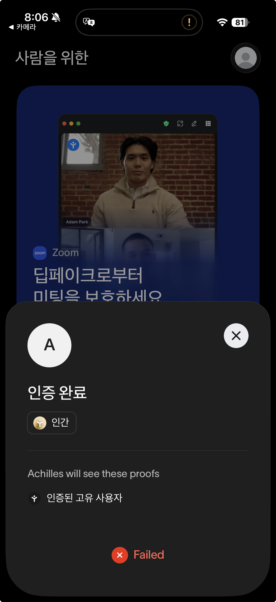
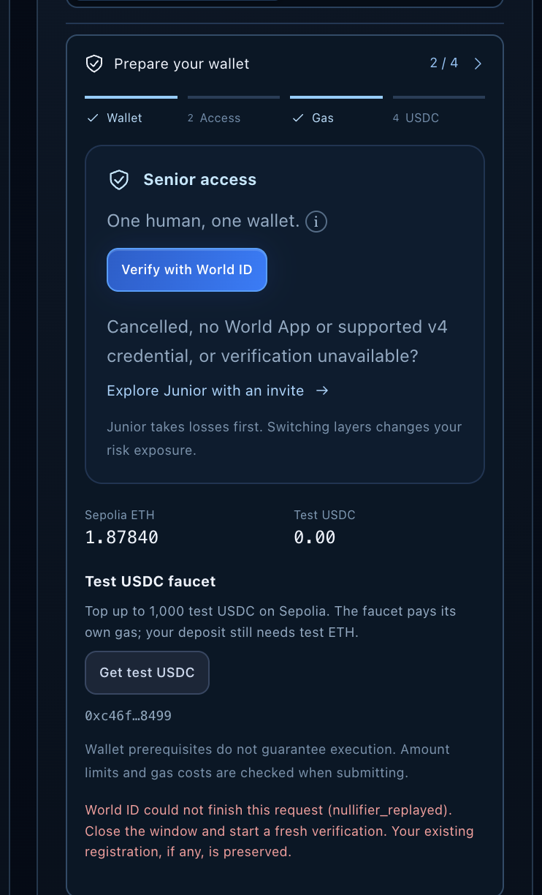

# Achilles integration feedback

This records findings from the current integration. It does not claim unrecorded
human verification or transaction success. The live evidence checklist below
must be completed for the submitted deployment.

## Uniswap

### What we built

- The stock basket adapter uses V3 `exactInputSingle` to rebalance testnet assets.
  See [StockBasketSource](contracts/contracts/sources/StockBasketSource.sol#L272),
  particularly `rebalance`, `_sellForShortfall`, and `_swap`.
- The stablecoin adapter uses V2 swaps and liquidity provision/removal. See
  [StablePoolSource](contracts/contracts/sources/StablePoolSource.sol#L92),
  particularly `allocate`, `release`, `_swap`, and `_addLiquidity`.
- The frontend reads token balances, pool quotes/reserves, LP ownership, and
  finalized settlement records. See [reads](frontend/src/lib/reads.ts),
  [Allocation](frontend/src/components/Allocation.tsx), and
  [StockPricesChart](frontend/src/components/StockPricesChart.tsx).

### Friction and improvements

1. Pool spot quotes and finalized portfolio valuations have different meanings.
   We display their provenance and comparison baseline separately, retain missing
   values, and never label a settlement delta as a 24-hour return.
2. Token ordering and decimals affect `sqrtPriceX96` conversion and holdings
   valuation. Frontend tests cover both orientations, token decimals, zero
   prices, and missing data.
3. A short testnet history can turn entry costs into a misleading annualized
   figure. The UI reports a period return until sufficient history exists.
4. Deployment provenance must be established per network/version. Sepolia V2
   addresses match the official factory/router list; a testnet V3 deployment
   should not inherit a mainnet provenance claim.

The highest-impact documentation improvement for this integration would be one
worked example connecting pool token ordering/decimals, executable quotes, and
portfolio valuation, with explicit spot-price and testnet assumptions.

Before submission, attach the actual swap and LP add/remove receipts and complete
the separate [hackathon feedback form](https://developers.uniswap.org/hackathon-feedback)
with a link to this file. Creating this file does not submit that form.

## World IDKit

**Trust event:** grant Senior registration to one verified human at one wallet.

**Why Proof of Human is the minimum sufficient credential.** The thing being
protected is scarcity, not identity. Senior takes a fixed rate ahead of Junior,
so the failure we must prevent is one actor claiming that rate from fifty
wallets. Answering "is this a distinct person?" is exactly enough to stop it.
Passport or NFC would additionally tell us nationality, age and legal name —
none of which the allocation rule consults, all of which we would then be
holding. Selfie Check would bind a face to a wallet for a product that never
needs to recognise a returning face. Proof of Human is the smallest credential
that closes the actual hole, so it is the one we ask for. This registration rule
restricts duplicate humans; it does not cap how much any one of them invests.

**Integration:** IDKit uses a server-signed RP context. The backend validates the
action, environment, wallet signal, credential, verified response, and nullifier
before recording the human/wallet binding and granting permission. A partial
success can be retried without silently skipping the permission step.

**Alternative paths, demonstrated.** Two are visible in the captures below.

*A second wallet, same human — refused.* The proof itself succeeds in World App
("Verified · Human"), and the request still fails: the protocol will re-verify a
replayed proof, so uniqueness has to be enforced where the binding is recorded.
Our contract rejects a nullifier or a wallet that is already bound, and the app
reports `nullifier_replayed` and tells the person their existing registration is
untouched.

| World App | Achilles |
| --- | --- |
|  |  |

*No credential, or a cancelled verification — a different product, not a
bypass.* The same panel offers "Explore Junior with an invite" to anyone who
cancels, has no World App, or has no supported v4 credential. Junior is open
because it absorbs losses first and has no cap, so there is nothing to farm;
what it is not is a side door into the Senior rate. The panel says so where the
choice is made: "Junior takes losses first. Switching layers changes your risk
exposure."

**Observed friction:** a successful proof, a confirmed HumanRegistry transaction,
and propagated deposit permission are distinct states. The UI must not announce
deposit readiness at the first of these boundaries.

**Most useful improvement:** a documented resumable example for verification →
on-chain registration → delayed cross-chain permission, including cancellation
and a retry after the registration transaction succeeds.

**Time to first success:** about an hour from starting the integration to a real
Orb proof verifying and the wallet being granted Senior access. Most of that was
not the widget — `proofOfHuman` with a signal was quick — it was working out the
server side: which fields `rp_context` needs, how the relying party signs the
request, and what the verify response actually returns.

## Curvegrid — real-world asset tokenization

**What is tokenized.** An eight-name technology equity basket, held by a spoke
adapter and rebalanced against Uniswap V3 pools, plus a stablecoin liquidity
position. Both report valuations into the same settlement round, so one portfolio
spans two chains and two asset types.

**What the tokenized form makes possible.** Tokenizing is the premise; the
submission is about what sits on top:

- A **fixed-rate senior claim** on that portfolio, priced by contract. Senior
  accrues a fixed APR ahead of Junior every settlement and Junior takes the
  residual — an on-chain treasury tranche over a real basket, with the waterfall
  in [SettlementFacet](contracts/contracts/hub/ledger/SettlementFacet.sol) rather
  than in a fund administrator's spreadsheet.
- **Transfer rules that travel with the asset.** Shares are ERC-1404; every
  transfer consults [AllowlistHook](contracts/contracts/spoke/AllowlistHook.sol).
  Eligibility is granted once on the hub and replicated to each spoke, so one
  decision governs the asset on every chain it reaches.
- **Differentiated access to the same assets.** The scarce claim (Senior) is
  gated on a verified human through
  [HumanRegistry](contracts/contracts/spoke/HumanRegistry.sol); the
  loss-absorbing claim (Junior) is open. Two claims on one portfolio, two
  admission rules, both enforced on chain.
- **An auditable settlement workflow.** ERC-7540 request/claim, with every stage
  of every request and settlement — which chain answered, which bridge attempt
  failed — written to the hub's transaction registry and readable by anyone. The
  indexer that fills it is in [indexer](indexer/).

**Limits we are not glossing over.** These are testnet representations. Holding a
basket token is not ownership of a legal share, and the pool quotes are not
exchange prices. What we claim is the machinery around the asset, not the legal
wrapper.

### MultiBaas

Used for indexed history only: the activity panel reads decoded past events
through a server-only reader credential
([proxy](frontend/src/app/api/multibaas/route.ts),
[PoolActivity](frontend/src/components/PoolActivity.tsx)). Current state —
balances, claimability — comes from direct chain reads, which stay authoritative.

**Observed friction:** after a redeploy we had an `addressAlias` still pointing at
the previous deployment. Queries then returned an empty list rather than an
error, which reads exactly like "no events yet" and took a while to distinguish
from a genuinely quiet contract. Our deploy script now deletes the alias before
recreating it.

**Most useful improvement:** refusing to re-link an existing alias to a different
address, or surfacing the mismatch in the response, would have made that
immediate.

## Live evidence

Confirmed on the submitted deployment (productId `0x0000000200000010`):

- **Deposit → settlement → claim.** A 10 USDC Junior deposit recorded end to end
  in the hub's request registry: `1 Requested ✓ · 2 Bridged to hub ✓ · 3 Queued ✓`,
  with both capital chains reporting `4 Sent to source ✓ · 5 Supplied ✓`, ending
  `status 6 (Completed)` and 10.0 USDC claimable on the vault.
- **Settlement rounds.** Consecutive rounds settling with both spokes answering,
  around 1m40s per round on a 5-minute cadence. A round that lost a spoke's answer
  was reopened automatically and settled on the retry.
- **Recorded settlement trails.** Rounds closing at `status 9 (Settled)` with the
  per-chain step trail filled, including the finalize legs on rounds that had
  approvals.
- **World ID.** A live Orb proof verified against the protocol and bound on chain;
  the team confirmed a successful run through the UI.
- **Uniswap V2.** LP position held and valued by the adapter, with swaps executing
  against the pair continuously.

Still to capture before submission:

- **A cancelled verification, captured.** The duplicate-human refusal is recorded
  above; a cancellation that leaves access locked is not yet.

We are stating what was observed, not what the tests imply. Anything above that a
judge cannot reproduce from the repository should be treated as unverified.
